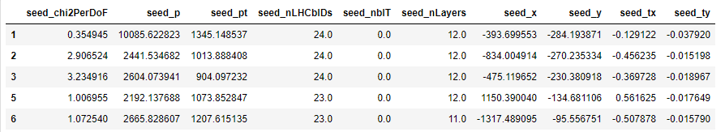
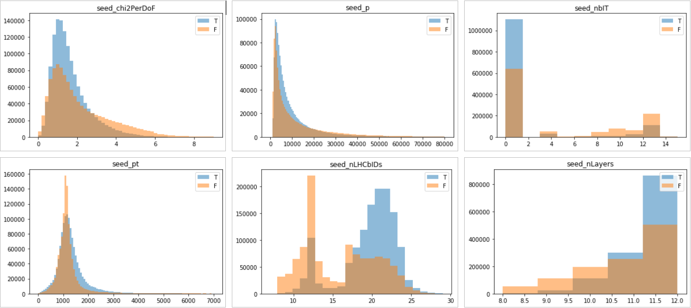
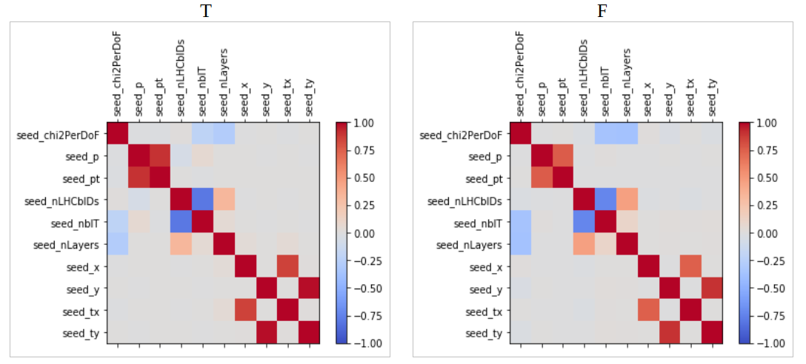

# PITE-PyTorch
Track Reconstruction using pytorch.

## Overview:

The main goal of the project is to show how different models perform with the problem of binary classification with given data from LHCb experiment, how to build your own model using libraries like sklearn or pytorch and to tune hyperparamiters of your model.

## current goal:
Now we are trying to understend the data and create good model that is suposed to predict if the particle with given features will be possible to detect in downstream detectors or if it's a "gohst particle".

## Future plans:
We woudl like to prepare some kind of guide or lecture to show how to use machine learning and deep machine learning models from sklearn and pytorch so that it can be used for teaching at our university.

## Data:
### We got over two million samples with 10 features, splited in to two categories determine by **is_downstream_reconstructible** to work with:

### To understeand our data we split it for two classes and compare them side by side like this:

### Also, we create corelation matrix to drop most corelated features:

Code can be found hear: [DataAnalysis](https://github.com/Kavaldrin/PITE-PyTorch/blob/master/DataAnalysis.ipynb)
    
## SKLEARN:

### Random forest clasifier:
We mennaged to get score of 81% accuracy with this model and auc 0.87. 
With tuning by hand we got 80% accuracy, trying grid serch cross validation and random search we got same result of 81%. 
[RFC](https://github.com/Kavaldrin/PITE-PyTorch/blob/master/RFC.ipynb)

### Support Vector Machines:
I usually get score of ~80% accuracy with this model and auc 0.86. 
I use NuSVC model. I dropped some features to get better score also to make training faster. Tuning by guessing gave me 80% score. 
I will try to search for better hyperparametrs using Grid Search. 
[SVC](https://github.com/Kavaldrin/PITE-PyTorch/blob/master/svm.ipynb)
    

## Authors

* **Kamil Hałat** - [Barnabasz](https://github.com/Barnabasz)
* **Miłosz Filus** - [Kavaldrin](https://github.com/Kavaldrin)
* **Dawid Gwiżdż** - [Nabiz](https://github.com/Nabiz)
* **Michał Piwowarczyk** - [MichalPiwo](https://github.com/MichalPiwo)
See also the list of [contributors](https://github.com/Kavaldrin/PITE-PyTorch/contributors) who participated in this project.

# 
  
